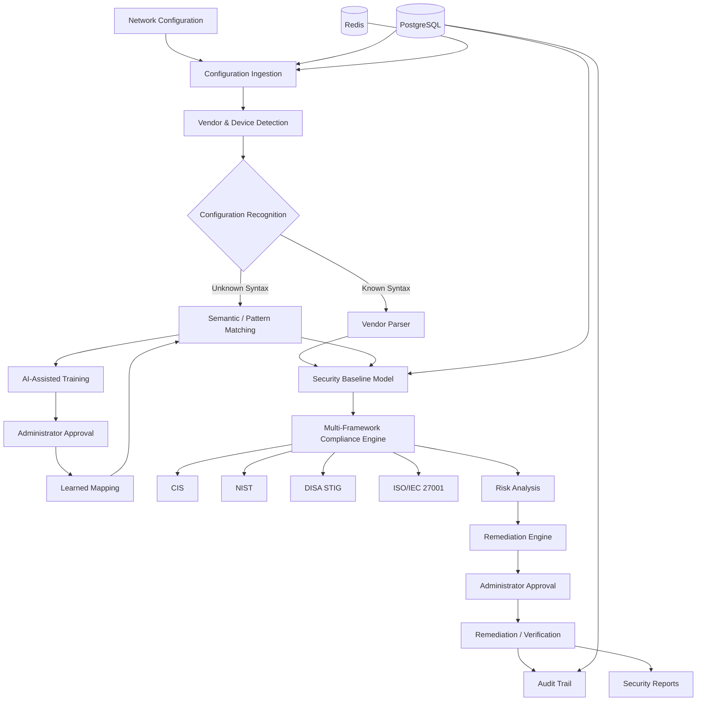

# NetSecure Analyzer

## AI-Driven Multi-Vendor Network Security Compliance Auditor

NetSecure Analyzer is a web-based network security configuration auditing platform designed for heterogeneous, multi-vendor network environments.

It ingests network-device configurations, identifies vendor and device characteristics, normalizes security-relevant settings into a vendor-neutral Security Baseline Model, evaluates configurations against multiple security frameworks, identifies unknown configuration syntax through AI-assisted semantic matching, provides device-specific remediation guidance, and maintains an auditable security workflow.

---

## Overview

Modern enterprise networks contain routers, switches, firewalls, and specialized networking platforms from multiple vendors.

Each vendor can use different:

- CLI syntax
- Configuration structures
- Security terminology
- Operating systems
- Firmware versions
- Device capabilities

This makes centralized security auditing difficult.

NetSecure Analyzer addresses this problem by separating **vendor-specific configuration interpretation** from **vendor-neutral security evaluation**.

Instead of building a separate compliance engine for every vendor, configurations are transformed into a common security model and evaluated against reusable compliance controls.

---

## Problem

Traditional network security configuration auditing faces three major challenges.

### 1. Vendor and Syntax Diversity

The same security requirement can be represented differently across Cisco, Fortinet, Juniper, Arista, and other network platforms.

### 2. Compliance Fragmentation

Organizations may need to evaluate infrastructure against multiple frameworks such as:

- CIS
- NIST
- DISA STIG
- ISO/IEC 27001

Manually checking each framework increases operational effort and inconsistency.

### 3. Unknown or Changing Configuration Syntax

New vendors, operating-system versions, device models, and previously unseen configuration structures can cause traditional parsers to fail.

NetSecure Analyzer introduces an administrator-guided learning workflow so previously unknown syntax can be mapped to security parameters and reused in future analysis.

---

# Solution

NetSecure Analyzer provides a centralized security compliance workflow:

```text
Network Configuration
        |
        v
Configuration Ingestion
        |
        v
Vendor & Device Detection
        |
        +----------------------+
        |                      |
        v                      v
Known Vendor             Unknown Syntax
        |                      |
        v                      v
Vendor Parser          Semantic / Pattern Matching
        |                      |
        +----------+-----------+
                   |
                   v
        Security Baseline Model
                   |
                   v
        Multi-Framework Engine
          /       |       |       \
        CIS     NIST    STIG      ISO
          \       |       |       /
                   |
                   v
             Risk Analysis
                   |
                   v
        Remediation Recommendations
                   |
                   v
        Approval / Verification
                   |
                   v
          Audit Trail & Reports
```

---

## Key Features

### Configuration Ingestion

- Single configuration upload
- Bulk configuration ingestion
- Configuration analysis workflow
- Structured configuration storage
- User-scoped configurations

### Vendor & Device Intelligence

- Multi-vendor detection
- Device-type identification
- Vendor, product, model, and firmware information where available
- Serial-number and hardware metadata extraction where available
- Vendor-neutral downstream processing

### Security Baseline Model

Vendor-specific configuration constructs are converted into common security parameters such as:

```text
ssh_enabled
ssh_version
telnet_enabled
aaa_authentication
enable_secret
password_encryption
local_buffered_logging
remote_syslog
timestamps
```

This allows compliance controls to operate independently from vendor-specific CLI syntax.

---

## Multi-Framework Compliance

NetSecure Analyzer supports evaluation against:

- **CIS**
- **NIST**
- **DISA STIG**
- **ISO/IEC 27001**

The compliance engine evaluates applicable controls using:

- **PASS**
- **FAIL**
- **N/A**

Results can include:

- Control information
- Evidence
- Severity
- Risk information
- Compliance percentage
- Failed controls
- Remediation recommendations

The same normalized security model can therefore be evaluated against multiple frameworks.

---

## AI-Assisted Configuration Learning

A central design goal is to avoid requiring a complete hard-coded parser for every possible syntax variation.

When the system encounters previously unknown configuration syntax, the learning workflow can process it through semantic and pattern matching and present a candidate mapping for administrator review.

```text
Unknown Configuration Line
          |
          v
Pattern / Semantic Matching
          |
          v
Confidence Evaluation
          |
          v
Administrator Review
          |
          v
Approved Security Mapping
          |
          v
Learned Mapping
          |
          v
Future Configuration Analysis
```

Approved mappings are persisted and can be reused during subsequent configuration analysis.

This is a **human-in-the-loop adaptation workflow**. It is not a claim that a single machine-learning model automatically understands every possible network configuration syntax.

---

## Risk Analysis

For each analyzed configuration, the platform can provide:

- Selected compliance frameworks
- Control-level results
- PASS / FAIL / N/A classification
- Evidence
- Severity
- Risk information
- Compliance percentage
- Failed security controls
- Remediation recommendations

This gives security analysts a structured view of configuration posture and the controls requiring attention.

---

## Remediation

NetSecure Analyzer provides vendor-aware remediation recommendations.

The remediation engine maps security findings to appropriate device-specific commands or configuration guidance.

The workflow is:

```text
Finding
   |
   v
Recommended Remediation
   |
   v
Administrator Approval
   |
   v
Execution / Remediation
   |
   v
Verification
   |
   v
Audit Record
```

For supported live-device workflows, remediation can be followed by configuration verification.

---

## Live SSH Scanning

NetSecure Analyzer supports live network-device scanning through SSH for supported devices.

The live workflow can:

1. Connect to the device
2. Retrieve configuration information
3. Identify the device
4. Analyze security posture
5. Evaluate compliance frameworks
6. Generate findings
7. Provide remediation guidance
8. Verify remediation where supported
9. Record activity in the audit trail

---

## Reporting

The reporting workflow provides a consolidated security assessment containing information such as:

- Device identification
- Configuration information
- Selected frameworks
- Compliance results
- Failed controls
- Severity and risk information
- Evidence
- Remediation guidance
- Security assessment information

Reports can be printed or saved as PDF through the browser.

---

## Role-Based Access Control

NetSecure Analyzer includes role-based access control and permission-based application actions.

The application supports role-specific access for user classes such as:

- Administrator
- Security Analyst
- Auditor
- Viewer

Users operate on their permitted configurations and devices rather than sharing unrestricted application data.

---

## Audit Trail

Security-relevant application activity is recorded in an audit trail.

The audit workflow provides visibility into actions such as:

- Authentication
- Configuration operations
- Analysis activity
- Compliance activity
- Remediation actions
- Administrative activity

This provides traceability for security operations.

---

# System Architecture



---

## How the Platform Works

### 1. Ingest

A user uploads one or more network configuration files or initiates a supported live scan.

### 2. Detect

The system identifies vendor and device characteristics using configuration evidence and available device metadata.

### 3. Parse and Normalize

Known syntax is processed through vendor-specific parsing logic.

Unknown syntax can be processed through semantic and pattern matching and the administrator-guided learning workflow.

The resulting security parameters are represented through the Security Baseline Model.

### 4. Evaluate

The normalized security state is evaluated against the selected compliance frameworks.

### 5. Identify Risk

The platform identifies failed and applicable controls and associates them with severity and risk information.

### 6. Remediate

The system provides device-specific remediation guidance.

Supported live-device workflows can execute and verify remediation.

### 7. Audit and Report

Security activity and assessment results are recorded and exposed through audit and reporting workflows.

---

## Technology Stack

| Layer | Technology |
|---|---|
| Frontend | React, Vite, JavaScript |
| Backend | Python, FastAPI |
| Persistence | PostgreSQL |
| Runtime / Cache | Redis |
| Database Migrations | Alembic |
| Device Communication | SSH / Netmiko-based workflows |
| Compliance | Custom multi-framework rule engine |
| Testing | Pytest |
| Deployment | Docker, Railway, Vercel |

---

## Project Structure

```text
NetSecure-Analyzer/
|
+-- backend/
|   +-- app/
|   |   +-- api/                 # API routes
|   |   +-- models/              # Database models
|   |   +-- schemas/             # Request/response schemas
|   |   +-- services/            # Core analysis and security services
|   |   +-- vendor_parsers/      # Vendor-specific parsers
|   |   +-- ...
|   +-- alembic/                 # Database migrations
|   +-- tests/                   # Backend tests
|   +-- Dockerfile
|   +-- requirements.txt
|
+-- frontend/
|   +-- src/
|   |   +-- pages/               # Dashboard and application pages
|   |   +-- components/          # Shared UI components
|   |   +-- api/                 # API clients
|   |   +-- App.jsx
|   |   +-- App.css
|   +-- public/
|   +-- package.json
|
+-- docs/
+-- docker-compose.yml
+-- .gitignore
+-- README.md
```

---

## Local Development

### Prerequisites

Install:

- Python 3.x
- Node.js and npm
- Docker Desktop
- Git
- PostgreSQL and Redis through the project's Docker configuration

### 1. Clone the Repository

```bash
git clone https://github.com/surajjha2202/NetSecure-Analyzer.git
cd NetSecure-Analyzer
```

### 2. Start Infrastructure

From the project root:

```bash
docker compose up -d
```

### 3. Backend Setup

```powershell
cd backend

python -m venv venv
.\venv\Scripts\Activate.ps1

pip install -r requirements.txt

alembic upgrade head

uvicorn app.main:app --reload
```

Backend:

```text
http://127.0.0.1:8000
```

API documentation:

```text
http://127.0.0.1:8000/docs
```

### 4. Frontend Setup

Open a second terminal:

```powershell
cd frontend

npm install
npm run dev
```

The Vite development server will display the local frontend URL.

### Environment Configuration

Use the project's environment example files as the starting point for local configuration.

Never commit:

- Passwords
- API keys
- Private SSH credentials
- Production secrets
- Real device credentials
- Sensitive running configurations

---

## Testing

### Backend Regression Suite

```powershell
cd backend
.\venv\Scripts\python.exe -m pytest -q
```

### Frontend Production Build

```powershell
cd frontend
npm run build
```

The validated project state includes:

- **72 backend tests passing**
- **Frontend production build passing**
- **15 representative vendors / 60-case vendor matrix previously validated**
- Real Cisco Catalyst 8000V live SSH scan and remediation/verification flow previously validated

---

## Production Deployment

The application uses a separated frontend/backend deployment architecture:

```text
                    Users
                      |
                      v
             +----------------+
             |     Vercel     |
             | React Frontend |
             +----------------+
                      |
                      v
             +----------------+
             |    Railway     |
             | FastAPI Backend|
             +----------------+
                |          |
                v          v
        +-----------+  +-------+
        | PostgreSQL|  | Redis |
        +-----------+  +-------+
```

Production configuration uses environment variables for:

- Service URLs
- Database connectivity
- Redis connectivity
- Application secrets
- Frontend/backend integration

Health endpoints include:

```text
/api/health
/api/health/database
/api/health/redis
```

---

## Security Architecture

The application incorporates:

- Authentication
- Role-based access control
- Permission-based actions
- User-scoped resources
- Audit logging
- Environment-based secrets
- Database-backed application state
- Production CORS configuration
- Secure credential handling through environment variables

Sensitive configuration captures and local environment files are excluded from source control.

---

## Example End-to-End Workflow

```text
1. User Login
      |
2. Upload Configuration
      |
3. Vendor / Device Detection
      |
4. Configuration Parsing
      |
5. Security Baseline Creation
      |
6. Select Compliance Frameworks
      |
7. Run Compliance Analysis
      |
8. Review PASS / FAIL / N/A
      |
9. Review Risk & Evidence
      |
10. Generate Remediation
      |
11. Approve / Execute Remediation
      |
12. Verify Configuration
      |
13. Record Audit Event
      |
14. Generate Security Report
```

---

# SIH Problem Statement Alignment

**Smart India Hackathon 2026 — Problem Statement 26155**

**AI-Driven Multi-Vendor Network Security Compliance Auditor**

| Problem Requirement | NetSecure Analyzer |
|---|---|
| Heterogeneous network environments | Multi-vendor detection and modular parsing |
| Single configuration ingestion | Configuration upload and analysis |
| Bulk configuration ingestion | Bulk ingestion workflow |
| Vendor-neutral representation | Security Baseline Model |
| Framework deviation analysis | Multi-framework compliance engine |
| CIS | CIS compliance controls |
| NIST | NIST compliance controls |
| DISA STIG | DISA STIG controls |
| ISO/IEC 27001 | ISO/IEC 27001 controls |
| Unknown syntax | Semantic / pattern matching |
| Dynamic adaptation | Administrator-approved learned mappings |
| Human-in-the-loop training | AI Training workflow |
| Risk identification | Severity and risk analysis |
| Actionable remediation | Vendor-specific remediation guidance |
| Remediation verification | Live-device execution and verification where supported |
| Auditability | Audit trail |
| Reporting | Security assessment and browser PDF workflow |

The architecture is designed to separate vendor-specific configuration interpretation from reusable vendor-neutral compliance evaluation.

---

## Innovation

The key architectural idea is the combination of:

1. **Vendor-specific configuration interpretation**
2. **Vendor-neutral Security Baseline Model**
3. **Multi-framework compliance evaluation**
4. **AI-assisted semantic and pattern matching**
5. **Administrator-guided learning**
6. **Vendor-aware remediation**
7. **Live remediation verification**
8. **Auditability and role-based access**

The learning workflow allows administrators to approve mappings for previously unknown configuration syntax so that the mapping can be reused in later analysis.

---

## Scalability

The platform is designed around modular vendor parsing and vendor-neutral compliance controls.

This allows new vendor support to be added without redesigning the entire compliance engine.

Potential expansion areas include:

- Additional network vendors
- Cloud security configurations
- White-box networking
- SONiC-based devices
- Additional compliance frameworks
- Advanced ML/NLP models
- Scheduled compliance scans
- Continuous compliance monitoring
- SIEM/SOAR integrations
- Enterprise notification workflows
- Expanded automated remediation

---

## Current Project Status

The current project has a functional backend, frontend, compliance workflow, AI-assisted training workflow, RBAC, audit components, reporting workflow, and live network-device scanning/remediation capabilities.

Validated areas include:

- Backend regression tests
- Frontend production build
- Multi-vendor detection/parsing matrix
- Multi-framework compliance evaluation
- AI-assisted learned mappings
- Cisco Catalyst 8000V live SSH scanning
- Remediation and verification workflow
- Production deployment architecture

---

## Limitations

NetSecure Analyzer is designed as an extensible multi-vendor platform. Vendor support is dependent on available parser logic, configuration evidence, device capabilities, and remediation mappings.

AI-assisted learning is implemented as semantic/pattern matching and administrator-guided learning rather than a claim of a universal machine-learning model capable of understanding every possible network syntax.

Live scanning and automated remediation depend on device connectivity, credentials, supported device behavior, and available vendor-specific operations.

The current reporting workflow supports browser-based printing and Save as PDF. Server-side PDF generation can be added as a future productization enhancement.

---

## Future Scope

Potential future extensions include:

- Expanded vendor and platform coverage
- Cloud-native security configuration analysis
- SONiC and white-box networking support
- Additional compliance frameworks
- Advanced ML/NLP models
- Scheduled compliance scans
- Continuous compliance monitoring
- SIEM/SOAR integrations
- Enterprise notification workflows
- API integrations
- Expanded automated remediation
- Server-generated PDF report files

---

## License

This project is developed as part of the Smart India Hackathon 2026 initiative.
